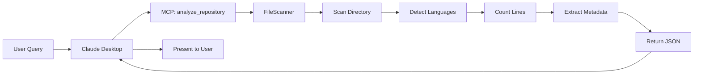
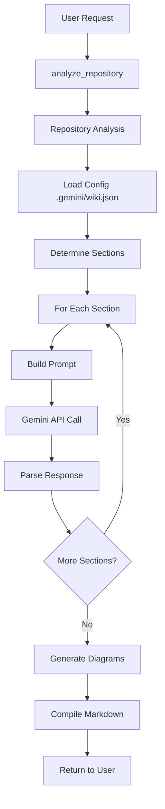
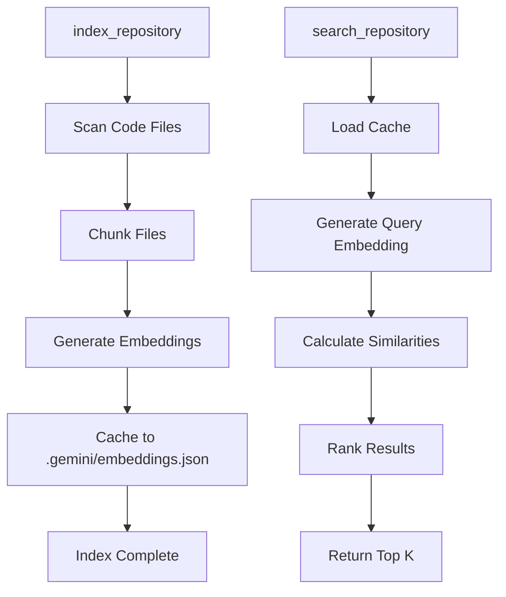

# Data Flow

How data flows through the Gemini Context Extension.

## Flow 1: Repository Analysis (No API)



**Steps**:
1. User asks to analyze repository
2. Claude invokes `analyze_repository` tool
3. FileScanner reads directory recursively
4. Language detection via file extensions
5. Line counting for statistics
6. Metadata extraction (README, LICENSE)
7. JSON response returned
8. Claude presents formatted results

**Performance**: 1-5 seconds for typical repositories

---

## Flow 2: Wiki Generation (With API)



**Steps**:
1. Repository analyzed first
2. Load custom config if exists
3. Determine which sections to generate
4. For each section:
   - Build AI prompt
   - Call Gemini API
   - Parse response
5. Generate diagrams
6. Compile to markdown
7. Return complete wiki

**Performance**: 30-120 seconds depending on sections

---

## Flow 3: Semantic Search (With API)



**Indexing Steps**:
1. Scan repository for code files
2. Chunk each file semantically
3. Generate embeddings via Gemini
4. Cache embeddings locally
5. Index complete

**Search Steps**:
1. Load cached embeddings
2. Generate embedding for query
3. Calculate cosine similarity
4. Rank by similarity score
5. Return top K results

**Performance**:
- Indexing: 10-60 seconds
- Searching: 1-3 seconds (after indexing)

---

## Flow 4: Context Tracking (No API)


**Steps**:
1. Find Gemini directory
2. Read settings for MCP servers
3. Count configured servers
4. Read extension GEMINI.md files
5. Count context files in hierarchy
6. Estimate token counts (or use API)
7. Calculate usage percentage
8. Return breakdown

**Performance**: <1 second

---

## Data Storage

### Read-Only Access
- Repository files
- README, LICENSE
- Package files (package.json, requirements.txt, etc.)
- .gitignore

### Write Access
- `.gemini/embeddings.json` (embedding cache)
- `.gemini/wiki.json` (user-created config)

### No Access
- Respects .gitignore patterns
- Skips common build directories
- No modification of source files

---

## Caching Strategy

### Embedding Cache
- **Location**: `.gemini/embeddings.json`
- **Purpose**: Avoid re-generating embeddings
- **Lifespan**: Until files change
- **Size**: 1-10 MB typical

### Token Counting
- **With API**: Real counts from Gemini
- **Without API**: Heuristic estimation
- **Caching**: Not cached, recalculated on demand

### Repository Analysis
- **No caching**: Always fresh scan
- **Reasoning**: Files change frequently

---

## API Call Patterns

### Batch Processing
```typescript
// Semantic indexing uses batches
for (let i = 0; i < files.length; i += concurrency) {
  const batch = files.slice(i, i + concurrency);
  await Promise.all(batch.map(processFile));
}
```

### Sequential Processing
```typescript
// Wiki sections are sequential
for (const section of sections) {
  const content = await generateSection(section);
  sections.push(content);
}
```

### Parallel Processing
```typescript
// Diagrams can be parallel
const diagrams = await Promise.all(
  diagramTypes.map(type => generateDiagram(type))
);
```

---

## Error Propagation

1. **Tool Level**: Try-catch returns error JSON
2. **Utility Level**: Throws errors with messages
3. **MCP Level**: JSON error responses
4. **User Level**: Claude explains error

Example:
```
File not found → Error object → JSON response → Claude explains
```

See [API Design](./API_DESIGN.md) for internal API details.
